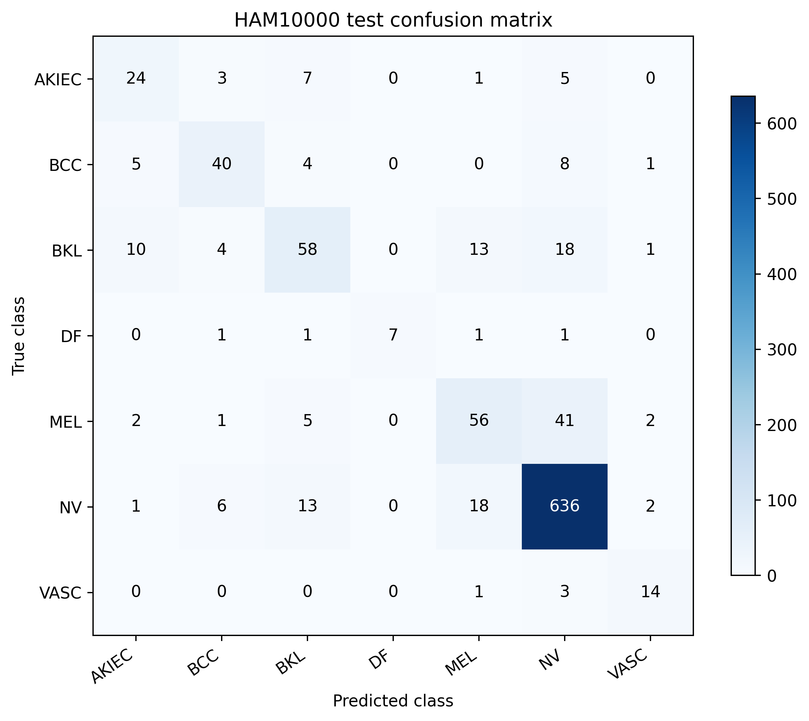
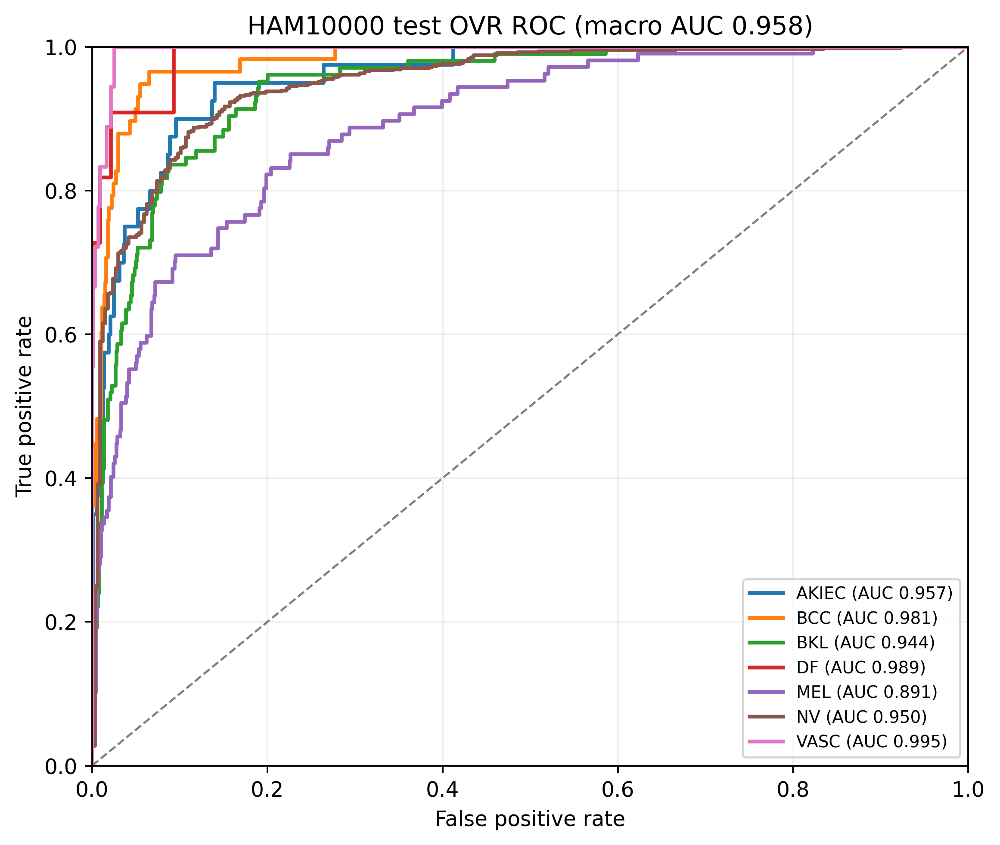
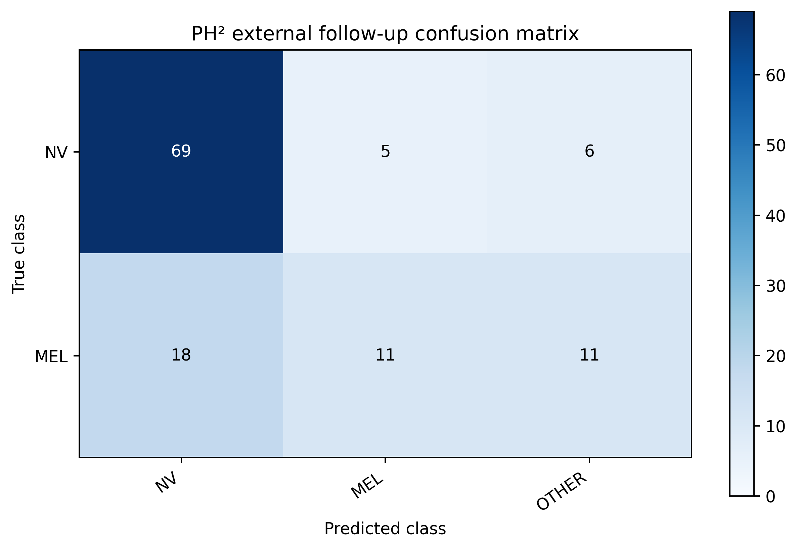
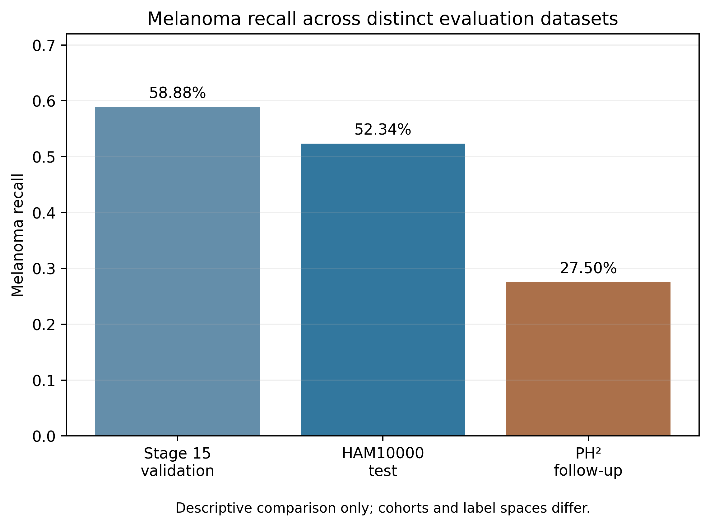
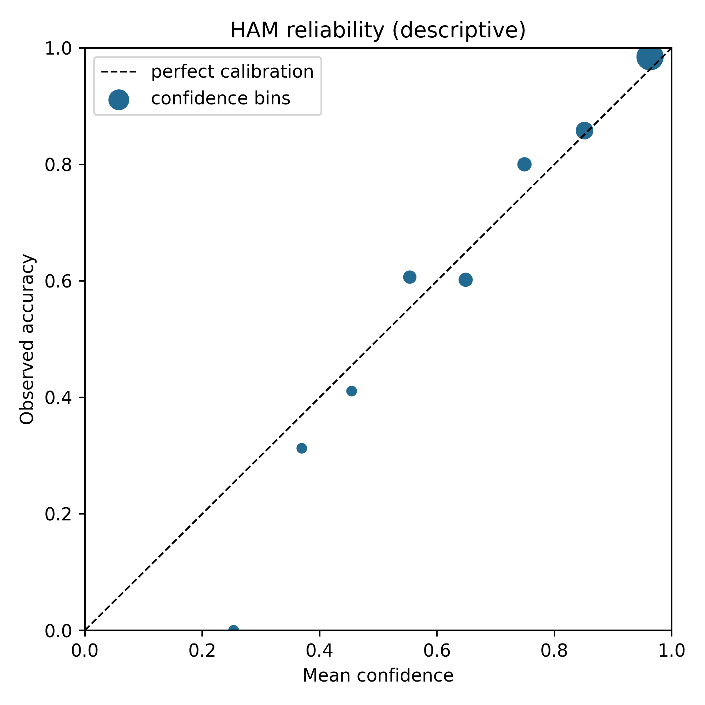
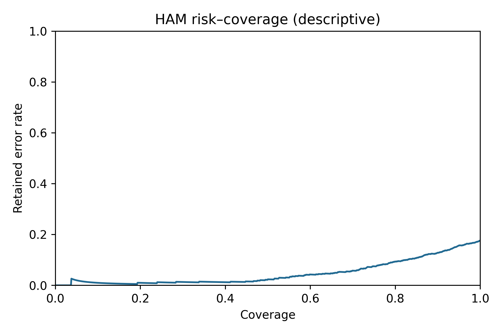
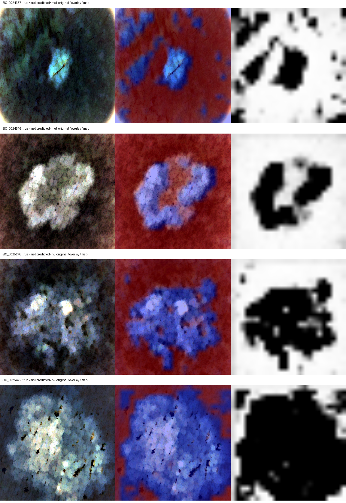
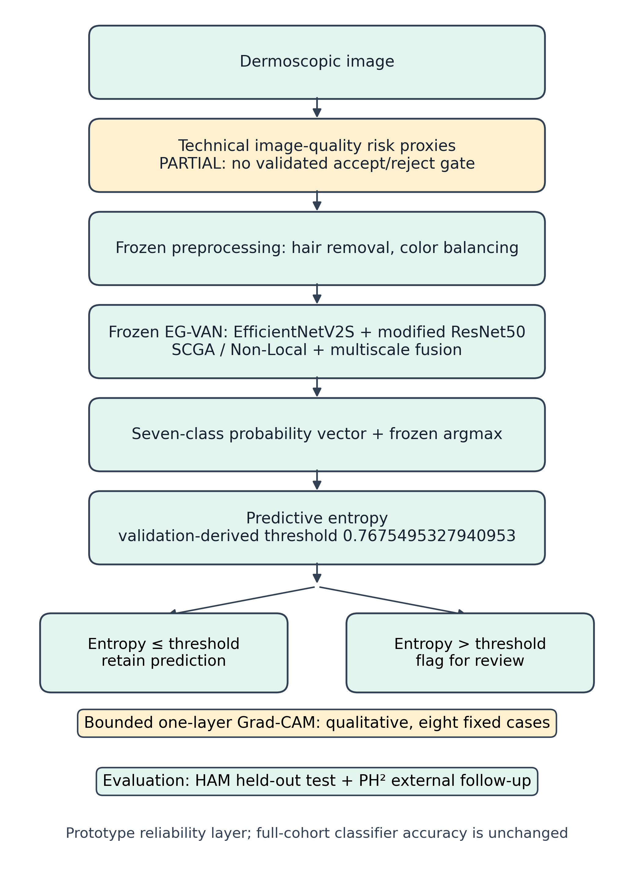

# EG-VAN+ as a Reliability-Extension Prototype: Seven-Class HAM10000 Evaluation and PH² External Follow-up

**Manuscript status:** author-review draft integrating the frozen Stage 15–16 evaluation and the exploratory Stage 20 reliability analyses. EG-VAN+ denotes a **qualified reliability-extension prototype**, not a fully validated clinical or image-quality-gated system. The implementation is an independent EG-VAN reconstruction, not the original authors' code.

## Abstract

**Background:** Aggregate classification accuracy does not establish image reliability, prediction certainty, or external transfer. **Methods:** We reconstructed seven-class EG-VAN and evaluated an EG-VAN+ reliability-extension prototype around one frozen, validation-selected checkpoint. A lesion-isolated HAM10000 split supplied 986 validation and 1,014 held-out test images; 120 mapped PH² cases supported external follow-up. Stage 20 used saved probabilities for uncertainty, calibration, and a validation-derived entropy review rule, measured technical image-quality proxies, and generated eight fixed-case final-model Grad-CAM maps. FP16 overflow in `resnet.nonlocal3` q@k was corrected with FP32 affinity under AMP elsewhere. **Results:** Full-cohort HAM test accuracy was 0.823471, macro F1 0.699582, macro OVR ROC-AUC 0.958206, and melanoma recall 56/107 (52.34%). The entropy threshold 0.7675495327940953, selected for approximately 80% validation coverage, retained 805/1,014 HAM cases (79.39%) with 90.93% accuracy **among retained cases** and sent 106/179 errors, including 23/51 melanoma false negatives, to review. Seven of eight selected Grad-CAM maps showed broad high response around a conspicuous central region; no lesion masks established localization correctness. PH² follow-up accuracy was 66.67% and melanoma recall 11/40 (27.5%). **Conclusion:** Exploratory uncertainty-based review triaged some errors without changing full-cohort classifier accuracy. Technical quality measures lacked a validated accept/reject gate, and melanoma sensitivity and external transfer remained limited. PH² had prior project use and is external follow-up, not untouched validation; the prototype is not clinically validated.

## 1. Introduction

EG-VAN combines dual feature branches, local and non-local attention, and multiscale fusion [1]. Aggregate accuracy can obscure class-specific errors in imbalanced HAM10000 [2], while even a correctly classified image may have uncertain probability estimates or technical defects. We independently reconstructed EG-VAN, evaluated one preregistered melanoma-objective candidate, and examined three reliability dimensions around its frozen checkpoint: technical image-quality risk, predictive uncertainty and review, and external follow-up. Bounded final-model Grad-CAM supplied qualitative visualization. This work evaluates a **prototype**, not clinical readiness or an operational image-quality rejector.

### 1.1 Related work and study scope

The published EG-VAN combines EfficientNetV2 and a modified ResNet branch with local and non-local attention and multiscale fusion [1]. EfficientNetV2 [4], residual networks [5], non-local operations [6], and focal loss [7] provide established components. HAM10000 [2] supplied the seven-class development and internal evaluation data; PH² [3] supplied the predefined overlapping-label follow-up. The original publication reported approximately **98.2% accuracy** under its reported nine-class setting. Our reconstruction used a different seven-class task, frozen lesion-isolated split and evaluation protocol; its 82.35% held-out HAM accuracy is **not** a direct replication comparison or performance ranking against 98.2%.

## 2. Methods

### 2.1 Dataset and lesion-isolated split

The frozen, lesion-isolated HAM10000 split [2] contained 8,015 training, 986 validation, and 1,014 test images. Image IDs were unique; each lesion ID belonged to only one partition. The split file is `data/splits/split_leakage_aware.csv` (SHA256 `f1c04c5ef5b54372c667daf0aebc29e6f24743c6c2cc094f16e2c4e679149883`). This test partition was withheld from **Stage 15** selection, although an earlier project stage evaluated a different model on the same HAM test partition; it should not be called never-before-accessed project data. The seven diagnosis labels, in model order, were actinic keratoses/intraepithelial carcinoma (AKIEC), basal cell carcinoma (BCC), benign keratosis-like lesions (BKL), dermatofibroma (DF), melanoma (MEL), melanocytic nevi (NV), and vascular lesions (VASC).

### 2.2 EG-VAN architecture

The reconstruction paired EfficientNetV2-S [4] with a modified ResNet50 branch [5]. Spatial-context group attention followed the first two retained ResNet stages, and non-local blocks [6] followed the next two. Features from four EfficientNet tap stages and four corresponding ResNet stages entered serial multiscale fusion units; each unit received the preceding fusion output after the first unit. Aligned fusion outputs and both terminal branch features were concatenated before projection, global average pooling, and seven-class classification. The published paper [1] does not fully specify the exact tap subset, carry operator, spatial alignment, or all attention parameters. These were explicit local reconstruction choices documented in the Stage 8B paper-to-code audit, not claims of author-code identity.

### 2.3 Preprocessing and training protocol

HAM images entered the model at 384×384 pixels after the repository's frozen hair-removal, Gray World, and multiscale Retinex preprocessing and ImageNet normalization. The published EG-VAN paper motivates the color-balancing concepts [1]; the exact implementation is defined by this repository's frozen preprocessing code and protocol. Random flips and rotation were restricted to training; validation and test used deterministic resize, tensor conversion, and normalization. Stage 15 training used seed 42, 25 epochs, a physical and effective batch size of 16, weighted replacement sampling with 8,015 draws per epoch, Adamax (learning rate 0.001, weight decay 0.0001), ReduceLROnPlateau, and focal loss [7] (α = 0.25, γ = 2). The registered candidate multiplied focal-loss terms for **true** melanoma examples by 1.2815247721366766 while retaining the original melanoma sampler weight 1.5630495442733532. This was one prespecified candidate, not a parameter sweep. Only HAM training examples updated weights; only HAM validation determined checkpoint eligibility and selection.

### 2.4 Numerical-stability handling and checkpoint selection

A bounded numerical investigation localized FP16 overflow to the q@k affinity `torch.bmm(q, k)` in `resnet.nonlocal3`. The corresponding FP32 affinity exceeded the FP16 representable range. Only that multiplication was executed in FP32; the surrounding model used CUDA automatic mixed precision. This execution policy addressed numerical stability and is not evidence of improved classification accuracy.

Before test evaluation, an epoch was eligible only if validation melanoma recall was at least 63/107 (0.5887850467289719), melanoma F1 at least 0.5757731958762886, macro F1 at least 0.6509124104985493, accuracy at least 0.8025152129817445, and nevus recall at least 0.917209653092006. These are the exact frozen thresholds in `selection_rule.json`. The lowest common unweighted validation focal loss among eligible epochs determined the checkpoint, with earlier epoch breaking an exact tie. Epoch 16 passed all gates and was frozen before any final HAM test or PH² result was used. The original epoch-16 weight file failed to persist; a bounded recovery from an archived epoch-13 checkpoint exactly reproduced available epoch-14–16 training-history and validation artifacts. The recovered selected checkpoint was independently audited and used for all final evaluations. Its SHA256 is `85fcad4b184da16dd741f2d539a05f8a1f0c8d1d015298f4ce5aadf7ef4d16d5`.

### 2.5 HAM held-out evaluation

HAM10000 final evaluation used the frozen 1,014-image test partition, deterministic evaluation transforms, seven-class argmax, `model.eval()`, inference mode, and the registered selective-FP32 policy. No threshold was fitted on test predictions. Accuracy and classwise metrics were computed from the fixed argmax labels; one-versus-rest (OVR) ROC-AUC was computed from the saved seven-class probabilities. We report accuracy, balanced accuracy, macro and weighted F1, classwise precision/recall/F1, confusion matrix, and macro/weighted OVR ROC-AUC. Ranking discrimination measured by AUC does not imply the same sensitivity at the fixed argmax decision rule.

### 2.6 PH² external follow-up

The separately defined PH² database [3] contributed 80 common nevi mapped to NV and 40 melanomas mapped to MEL; 80 atypical nevi were excluded under the existing project protocol. Original PH² BMP images were converted to RGB, passed through the frozen hair-removal/Gray World/Retinex preprocessing, encoded and decoded as JPEG in memory to match the HAM representation, then resized to 384×384 and ImageNet-normalized. Predictions into any of the five other HAM classes remained OTHER and counted as incorrect; the mapped confusion matrix consequently has two true rows and three predicted columns. PH² had prior use in the project and is an **external follow-up evaluation**, not untouched external validation. Neither final dataset was used to tune thresholds, preprocessing, checkpoint choice, or the model.

### 2.7 Technical image-quality proxy analysis

Eight deterministic proxies—mean grayscale brightness, grayscale contrast, Laplacian-variance sharpness, mean saturation, dark-pixel ratio, bright-pixel ratio, grayscale entropy, and local illumination variation—were available for all 10,015 **processed** HAM images. Thresholds of 30 and 225 define dark/bright pixel counts, not image acceptability. The 986 selected-checkpoint validation prediction IDs were joined to the quality table; equal-count validation terciles for brightness, contrast and sharpness were compared descriptively for error, confidence, predictive entropy and melanoma false negatives. No human quality labels, prospective quality cutoff, binary accept/reject gate, or raw-image pre-classifier screen was available. The quality component is a technical risk assessment only.

### 2.8 Predictive uncertainty

The frozen final model's saved seven-class probability vectors were used without rerunning HAM or PH² classification. Maximum softmax probability (MSP) was `max_c p_c`; predictive entropy was `H(p) = −Σ_c p_c ln(p_c)` with `0 ln(0) = 0`. Error-detection AUROC treated an incorrect argmax as positive and compared `1 − MSP` with entropy. These are uncertainty scores, not guarantees of calibrated or clinically safe decisions. The selected epoch-16 validation predictions supplied 986 observations for choosing the review metric; HAM test and PH² probabilities were used only after that validation-derived decision was frozen.

### 2.9 Calibration evaluation

For each saved-probability dataset, expected calibration error (ECE) used ten fixed equal-width MSP bins over [0,1], weighting the absolute difference between mean confidence and observed accuracy by bin frequency. Seven-class Brier score was the sample mean of `Σ_c (p_c − 1[y=c])²`, without dividing by seven; negative log likelihood used the mapped true-class probability clipped only for numerical log stability. Reliability diagrams and correct/incorrect confidence distributions were generated from saved outputs. No temperature scaling or calibration transform was fitted. PH² calibration describes only the included NV/MEL truth cohort scored against the original seven probabilities and is limited by its label mapping and prior project use.

### 2.10 Validation-derived selective-review protocol

The Stage 20 protocol compared validation error-detection AUROC for `1 − MSP` and entropy, choosing the higher (with an exact tie resolved in favor of `1 − MSP`). It fixed a target of at least **80% validation retained coverage**: the threshold was the score of the `ceil(0.8N)`-th least-uncertain validation image, accepting ties. Entropy won on validation; the rule retains a prediction when `H(p) ≤ 0.7675495327940953` and flags it for review otherwise. The metric and threshold were saved before Stage 20 HAM/PH² review calculations and were **not** selected using either evaluation set. For each cohort we report coverage, retained accuracy, errors captured by review, and melanoma false negatives reviewed. Descriptive risk–coverage curves do not redefine the operating rule. Because Stage 16 outcomes had already been viewed in the broader project, Stage 20 selective-review results are exploratory, not a new untouched confirmatory evaluation.

### 2.11 Bounded Grad-CAM visualization

Eight HAM test IDs were fixed before viewing maps: two correct MEL, two MEL→NV, two correct NV, one correct BKL and one correct BCC, selected as the lexicographically first IDs in those saved-prediction groups. Frozen-checkpoint predicted-class Grad-CAM was generated at `resnet.nonlocal3` under the registered numerical execution policy. Eight `384×384` maps and overlays were hash-audited and qualitatively reviewed with their processed source images. These are **qualitative attention visualizations of one layer**; no lesion masks or localization ground truth were available. They do not establish clinical lesion localization, a causal whole-model explanation or an unbiased population frequency of visual patterns.

### 2.12 Statistical and evaluation metrics

Full-cohort HAM classification used the frozen seven-class argmax, classwise precision/recall/F1, macro and weighted summaries, confusion matrix, and one-versus-rest ROC-AUC. PH² used fixed NV/MEL truth with OTHER predictions counted as errors. Selective accuracy is conditional on retained cases and is never substituted for full-cohort classifier accuracy. The quality-tercile and risk–coverage analyses are descriptive; no causal effect, clinical threshold, confidence interval or formal hypothesis-test claim is made from them.

### 2.13 Reproducibility boundary

The final checkpoint, frozen split, Stage 15 preregistration, Stage 16 evaluator source, prediction CSVs, metrics JSONs, manifests, and figure inputs are retained at the paths listed in the repository's final experiment freeze. Stage 20 retains its metric/coverage protocol, validation-derived rule, saved-output analysis script and hashes, quality analysis, fixed Grad-CAM case list, downloaded map hashes and visual audit. Both evaluation manifests record SHA256 values for the checkpoint, sources, and outputs. The recovered epoch-16 checkpoint exactly reproduced available epoch-14–16 training-history and validation observables, but the original epoch-16 weight file is unavailable for a byte-level comparison. All final results therefore refer to the audited recovered checkpoint.

## 3. Results

### 3.1 Validation selection

Selected epoch 16 had validation focal loss 0.083874, accuracy 0.819473, macro F1 0.661131, MEL recall 63/107 (0.588785), MEL F1 0.602871, and NV recall 0.939668. These values met all frozen eligibility gates. They are **validation** results used for selection; the subsequent figures and test metrics were not selection inputs.

**Table 1. Selected HAM10000 validation versus held-out HAM10000 test.** The partitions serve different roles; differences are descriptive.

| Metric | Validation (n = 986) | Held-out test (n = 1,014) |
|---|---:|---:|
| Accuracy | 0.819473 | 0.823471 |
| Macro F1 | 0.661131 | 0.699582 |
| MEL recall | 0.588785 (63/107) | 0.523364 (56/107) |
| MEL F1 | 0.602871 | 0.568528 |
| NV recall | 0.939668 | 0.940828 |

### 3.2 Held-out HAM10000 test

On 1,014 test images, accuracy was 0.823471, balanced accuracy 0.675097, macro F1 0.699582, and weighted F1 0.818013 (Table 2). Macro OVR ROC-AUC was 0.958206. The seven-class confusion matrix is shown in Figure 1 and classwise outcomes in Table 3.

**Table 2. Overall seven-class HAM10000 held-out test performance.**

| Metric | Value |
|---|---:|
| Accuracy | 0.823471 |
| Balanced accuracy | 0.675097 |
| Macro precision | 0.739039 |
| Macro recall | 0.675097 |
| Macro F1 | 0.699582 |
| Weighted F1 | 0.818013 |
| Macro OVR ROC-AUC | 0.958206 |
| Weighted OVR ROC-AUC | 0.946609 |

**Table 3. Classwise HAM10000 held-out test performance.**

| Class | Support | Precision | Recall | F1 | TP | FP | FN |
|---|---:|---:|---:|---:|---:|---:|---:|
| AKIEC | 40 | 0.571429 | 0.600000 | 0.585366 | 24 | 18 | 16 |
| BCC | 58 | 0.727273 | 0.689655 | 0.707965 | 40 | 15 | 18 |
| BKL | 104 | 0.659091 | 0.557692 | 0.604167 | 58 | 30 | 46 |
| DF | 11 | 1.000000 | 0.636364 | 0.777778 | 7 | 0 | 4 |
| MEL | 107 | 0.622222 | 0.523364 | 0.568528 | 56 | 34 | 51 |
| NV | 676 | 0.893258 | 0.940828 | 0.916427 | 636 | 76 | 40 |
| VASC | 18 | 0.700000 | 0.777778 | 0.736842 | 14 | 6 | 4 |

**Figure 1.** HAM10000 held-out test confusion matrix (n = 1,014). Rows are true classes and columns are predicted classes; counts use the frozen seven-class argmax.

**Figure 2.** HAM10000 held-out test one-versus-rest ROC curves from saved class probabilities. Macro OVR AUC was 0.958206; curves describe ranking and do not replace the fixed-argmax classwise metrics.

### 3.3 Melanoma and classwise errors

The model identified 56 of 107 melanomas (recall 0.523364) and missed 51. Of those 51 false negatives, 41 (80.39%) were predicted NV, equal to 38.32% of all test melanomas. Five melanomas were predicted BKL; the remaining five were distributed across AKIEC, BCC, and VASC. The reverse NV→MEL transition occurred 18 times among 676 nevi. NV recall was 0.940828 and F1 was 0.916427, but melanoma F1 was 0.568528. DF precision was 1.000000 on only 11 examples and should not be overinterpreted.

### 3.4 PH² external follow-up

For the frozen 120-case mapped PH² cohort, accuracy was 0.666667 and balanced accuracy 0.568750. Melanoma precision was 0.687500, recall 11/40 (0.275000), F1 0.392857, and melanoma-probability ROC-AUC 0.542813. Nevus recall was 0.862500. Among 40 true melanomas, 18 were classified NV, 11 MEL, and 11 OTHER (all BKL in the seven-class output). Figure 3 displays the mapped confusion matrix. These PH² metrics belong to a different cohort and label space from the seven-class HAM test.

**Table 4. PH² external follow-up under the frozen NV/MEL/OTHER scoring policy.**

| Metric | Value |
|---|---:|
| Included samples | 120 |
| Accuracy | 0.666667 |
| Balanced accuracy | 0.568750 |
| MEL precision | 0.687500 |
| MEL recall | 0.275000 |
| MEL F1 | 0.392857 |
| NV recall | 0.862500 |
| MEL probability ROC-AUC | 0.542813 |

**Figure 3.** PH² external follow-up confusion matrix for 80 mapped NV and 40 mapped MEL cases. OTHER retains predictions from the five HAM classes outside NV/MEL and counts as incorrect; 80 atypical nevi were excluded.

**Figure 4.** Descriptive melanoma recall across Stage 15 validation (63/107), held-out HAM10000 test (56/107), and PH² external follow-up (11/40). These datasets and label spaces are not statistically interchangeable.

### 3.5 Predictive uncertainty and calibration

Validation error-detection AUROC was 0.821859 for `1 − MSP` and **0.827386 for predictive entropy**; the prespecified validation-only comparison therefore selected entropy for the review rule. HAM entropy error-detection AUROC was 0.858883, and mapped PH² follow-up AUROC was 0.766875. Table 5 reports observational probability-reliability metrics from the frozen seven-class outputs. ECE alone cannot establish perfect calibration, particularly in sparse bins or the restricted PH² cohort. No calibration transform was fitted.

**Table 5. Frozen-model probability reliability across distinct datasets.** ECE uses ten fixed confidence bins; Brier is the mean seven-class sum of squared probability errors. PH² is the included mapped follow-up cohort, not untouched validation. These comparisons are descriptive.

| Dataset | N | Entropy error-detection AUROC | ECE | Seven-class Brier |
|---|---:|---:|---:|---:|
| Selected HAM validation | 986 | 0.827386 | 0.019574 | 0.270595 |
| HAM held-out test | 1,014 | 0.858883 | 0.029678 | 0.256018 |
| PH² external follow-up | 120 | 0.766875 | 0.060178 | 0.491627 |

**Figure 5.** HAM test reliability diagram from saved full-cohort probabilities. Point size reflects bin count; the plot is descriptive and does not establish clinical probability calibration.

### 3.6 Validation-derived selective review

The frozen entropy cutoff was **0.7675495327940953**, selected for approximately 80% retained coverage on **validation**, not HAM test or PH². On HAM, 805/1,014 predictions (79.39%) were retained and 209 (20.61%) flagged for review. Accuracy **among retained cases under this exploratory selective-review rule** was 90.93%; the unchanged **full-cohort classifier accuracy** was 82.3471%. Review captured 106/179 original HAM errors (59.22%) and 23/51 melanoma false negatives, leaving 28 melanoma misses unflagged (Table 6). On mapped PH², the same rule retained 71/120 (59.17%), with 83.10% retained-case accuracy and 28/40 errors reviewed. These conditional accuracies reflect selection by uncertainty, not a change in classifier predictions.

**Table 6. HAM10000 selective-review outcome at the validation-derived entropy threshold.** The retained subset must not be interpreted as the full test cohort.

| Measure | Frozen HAM outcome |
|---|---:|
| Full-cohort classifier accuracy | 82.3471% of 1,014 |
| Retained coverage | 805/1,014 (79.39%) |
| Sent to review | 209/1,014 (20.61%) |
| Accuracy among retained cases under exploratory rule | 90.93% of 805 |
| Original errors sent to review | 106/179 (59.22%) |
| Melanoma false negatives sent to review | 23/51 |

**Figure 6.** Descriptive HAM retained-risk versus coverage curve from the fixed entropy score. The operating threshold came from validation, not from searching this test curve.

### 3.7 Technical image-quality proxy findings

All 986 validation predictions joined to the existing processed-image quality table. In prespecified equal-count terciles, low-sharpness images had a 22.19% error rate and middle-sharpness images 14.33%; the high-sharpness tercile was 17.63%, so the relationship was **non-monotonic**. These associations may reflect multiple image and class characteristics; they do not show that blur caused an error. No human quality labels or validated threshold justified a binary quality accept/reject gate. The quality component remains a descriptive technical risk assessment.

### 3.8 Qualitative final-model Grad-CAM

The eight fixed-case predicted-class `resnet.nonlocal3` maps and overlays were all `384×384`, finite, non-degenerate and matched their manifests. Visual review found broad high response around the conspicuous central lesion-like region in seven maps; one BCC example had a more focal response over central bright structures. Figure 7 shows four of the fixed cases; the other four were also audited. This **qualitative attention visualization** concerns one model layer and has no lesion-mask ground truth. It cannot establish clinically correct localization, a causal explanation, or whole-model focus.

**Figure 7.** Processed image, predicted-class overlay and grayscale Grad-CAM map for two correctly classified melanomas and two MEL→NV errors. At this layer, the displayed higher values are broad around the conspicuous central region. White in the grayscale map and red in the overlay indicate higher values. Case selection preceded visualization; no localization ground truth was available.

## 4. Discussion

The frozen reconstruction achieved 82.35% HAM test accuracy, 0.6996 macro F1, and 0.9582 macro OVR AUC. The high ranking-based AUC should be read alongside the fixed-argmax melanoma sensitivity of only 52.34%; these metrics answer different questions, and no post-test threshold was explored. Class imbalance matters because NV contributed 676 of 1,014 test examples. The frequent MEL→NV transition was the dominant melanoma failure pattern; its cause cannot be isolated from the saved predictions alone. This degree of missed melanoma is a substantial barrier to any clinical deployment claim.

Under the mapped PH² external follow-up, melanoma sensitivity was lower at 27.5% and melanoma-probability AUC was 0.5428. These observations support limited transfer in the evaluated external setting, while not establishing a specific causal source of the difference. PH² differs in image source and true-label space; atypical nevi were excluded, and predictions outside NV/MEL were explicitly retained as OTHER. Its 40 included melanomas and prior project use further limit claims of independent external confirmation. The selective FP32 q@k computation resolved a demonstrated numerical overflow but does not establish any classification improvement or explain the melanoma generalization pattern.

The reliability extension did not change the underlying classifier or its full-cohort 82.3471% HAM accuracy. Instead, a validation-derived entropy rule provided **error triage**: at 79.39% HAM retained coverage, accuracy among retained cases was 90.93%, while 59.22% of original errors were sent to review. This is a useful descriptive mechanism but not a new classifier accuracy or a guarantee against melanoma misses: only 23/51 melanoma false negatives were flagged. PH² retained coverage was lower at 59.17%, consistent with different score behavior under the mapped follow-up; its prior use prevents an untouched external-confirmation claim. Figure 8 summarizes the evidence-marked prototype pipeline.

The technical quality measures showed some association with validation errors, but the absence of quality labels and cutoff means a pre-model accept/reject gate was **not** validated. The eight Grad-CAM images also warrant restraint: seven had broad high response around a visually conspicuous central region at `resnet.nonlocal3`. These maps may reveal a limitation of that chosen explanation layer, but without lesion masks, further target layers or perturbation tests they neither establish clinical localization nor prove background reliance by the whole dual-branch model. The original EG-VAN paper's approximately 98.2% nine-class accuracy [1] is not directly comparable with this reconstruction's seven-class held-out result.

**Figure 8.** Evidence-marked intended reliability-extension path. Existing technical quality proxies were computed offline on processed HAM images; their pre-preprocessing position depicts the **intended**, unvalidated gate, not current operational ordering. The entropy review rule was chosen on validation; Grad-CAM is a bounded qualitative visualization. Neither retained-case accuracy nor the reliability layer changes the frozen full-cohort classifier result.

## 5. Limitations

HAM10000 class imbalance makes aggregate accuracy less informative for the smaller classes. Development and checkpoint selection used only HAM10000 training and validation; the same dataset family supplied internal testing. Although this test partition was withheld from Stage 15 selection, an earlier repository stage had evaluated another model on it, so it was not untouched at the project level. The final candidate missed 51 of 107 test melanomas, and dermatofibroma support was only 11, limiting subgroup interpretation. No prospective or clinical validation was performed.

The Stage 15 selected checkpoint was recovered from epoch 13 after the original epoch-16 weights failed to persist. Epochs 14–16 reproduced the available history and validation files exactly, but byte identity with the missing original weights cannot be proven; conclusions apply to the audited recovered checkpoint. The local numerical precision policy addressed an observed FP16 overflow and does not validate architecture superiority or melanoma generalization.

PH² has a different label space and acquisition domain, and the frozen overlap protocol excluded 80 atypical nevi. PH² had prior project use and cannot be described as untouched validation. Its 40 melanoma cases and substantially lower melanoma performance are compatible with domain shift but do not establish its mechanism or support broad generalization claims. No threshold adjustment, preprocessing change, checkpoint reselection, or training followed final HAM test or PH² access. This study does not establish clinical readiness or clinical failure.

The Stage 20 technical-quality analysis used proxies on **processed** HAM images rather than raw-image pre-classifier quality labels. It had no ground-truth quality annotation or prospectively justified reject threshold; the proposed quality gate is incomplete. Calibration metrics are observational and do not establish perfect calibration. Selective review was added after the project had already seen Stage 16 outcomes, so its HAM and PH² applications are exploratory despite a validation-derived fixed threshold. Earlier stages also accessed the same HAM test partition with different models.

Final-model Grad-CAM covered only eight deliberately selected HAM cases at one `resnet.nonlocal3` layer. No lesion masks or expert localization labels were available, and broad surrounding-region response appeared in seven maps; they cannot support clinical localization or causal whole-model explanation. These limitations join the already noted melanoma sensitivity gap, PH² prior use and label exclusions, and missing original epoch-16 weight-file byte identity. The system has not been prospectively or clinically validated. The full intended EG-VAN+ quality-gated objective remains **partial**, although several reliability dimensions have been implemented and descriptively evaluated.

## 6. Conclusion

The frozen recovered Stage 15 candidate achieved 0.823471 full-cohort HAM accuracy, 0.699582 macro F1 and 0.958206 macro OVR AUC, but melanoma recall was 56/107 (52.34%). The EG-VAN+ reliability-extension prototype added descriptive technical-quality analysis, probability calibration and uncertainty assessment, validation-derived exploratory selective review, and limited qualitative final-model Grad-CAM. The review rule flagged 106/179 HAM errors at 20.61% review rate without changing the classifier's full-cohort performance. Melanoma recall fell to 11/40 (27.5%) in the distinct PH² external follow-up. A validated image-quality gate and clinical safety evidence remain absent; these findings should be reported without test-driven model or threshold optimization.

## Contributions and scope

This study reconstructed a dual-branch EG-VAN model with documented implementation assumptions, localized and corrected an AMP numerical overflow, evaluated a frozen seven-class candidate on lesion-isolated HAM test data, and performed a mapped PH² external follow-up. Around that **unchanged** classifier, it evaluated saved-probability uncertainty and calibration, applied an exploratory validation-derived review rule, analyzed technical image-quality proxies, and audited bounded final-model qualitative Grad-CAM. It did **not** deliver a validated pre-classifier image-quality gate or establish that the original paper's reported accuracy was reproduced.

## Supplementary figures

The row-normalized HAM and PH² confusion matrices and HAM classwise F1/recall plots are presented with numbered captions in the [supplementary figure sheet](egvan_supplementary_figures.md). They derive from the same saved prediction and metric artifacts as Figures 1–4.

## References

1. Saeed A, Shehzad K, Ahmed S, Azar AT. *EG-VAN: A Global and Local Attention-Based Dual-Branch Ensemble Network With Advanced Color Balancing for Multi-Class Skin Cancer Recognition*. IEEE Access. 2025. DOI: [10.1109/ACCESS.2025.3561240](https://doi.org/10.1109/ACCESS.2025.3561240). Architecture source; this manuscript reports an independent reconstruction.
2. Tschandl P, Rosendahl C, Kittler H. *The HAM10000 dataset, a large collection of multi-source dermatoscopic images of common pigmented skin lesions*. Scientific Data. 2018;5:180161. DOI: [10.1038/sdata.2018.161](https://doi.org/10.1038/sdata.2018.161).
3. Mendonça T, Ferreira PM, Marques JS, Marçal ARS, Rozeira J. *PH²—A dermoscopic image database for research and benchmarking*. 35th Annual International Conference of the IEEE Engineering in Medicine and Biology Society (EMBC). 2013:5437–5440. DOI: [10.1109/EMBC.2013.6610779](https://doi.org/10.1109/EMBC.2013.6610779).
4. Tan M, Le Q. *EfficientNetV2: Smaller Models and Faster Training*. Proceedings of the 38th International Conference on Machine Learning. 2021;139:10096–10106. [Publisher record](https://proceedings.mlr.press/v139/tan21a.html).
5. He K, Zhang X, Ren S, Sun J. *Deep Residual Learning for Image Recognition*. Proceedings of the IEEE Conference on Computer Vision and Pattern Recognition. 2016. [CVF open access](https://openaccess.thecvf.com/content_cvpr_2016/html/He_Deep_Residual_Learning_CVPR_2016_paper.html).
6. Wang X, Girshick R, Gupta A, He K. *Non-Local Neural Networks*. Proceedings of the IEEE Conference on Computer Vision and Pattern Recognition. 2018:7794–7803. [CVF open access](https://openaccess.thecvf.com/content_cvpr_2018/html/Wang_Non-Local_Neural_Networks_CVPR_2018_paper.html).
7. Lin TY, Goyal P, Girshick R, He K, Dollár P. *Focal Loss for Dense Object Detection*. Proceedings of the IEEE International Conference on Computer Vision. 2017:2980–2988. [CVF open access](https://openaccess.thecvf.com/content_iccv_2017/html/Lin_Focal_Loss_for_ICCV_2017_paper.html).
