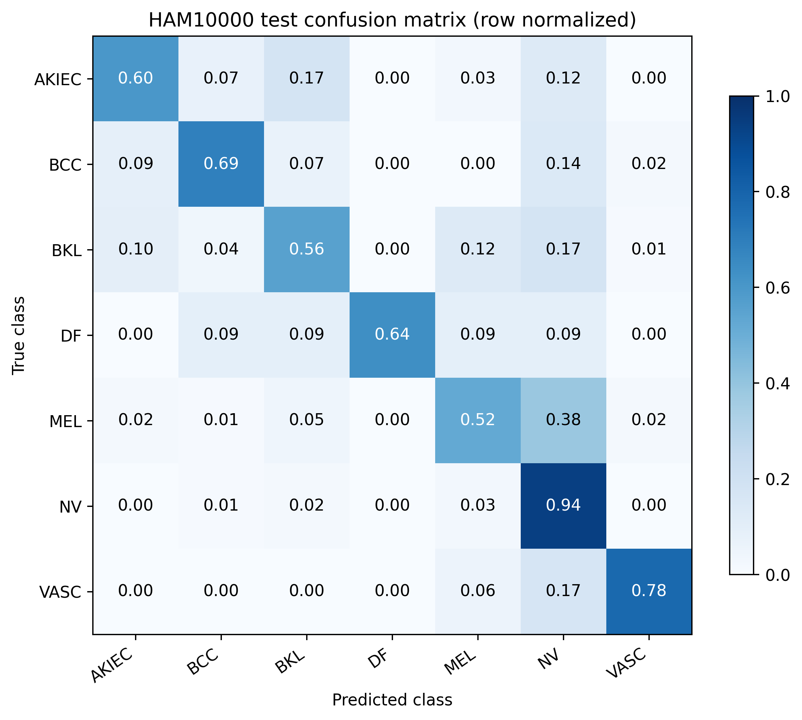
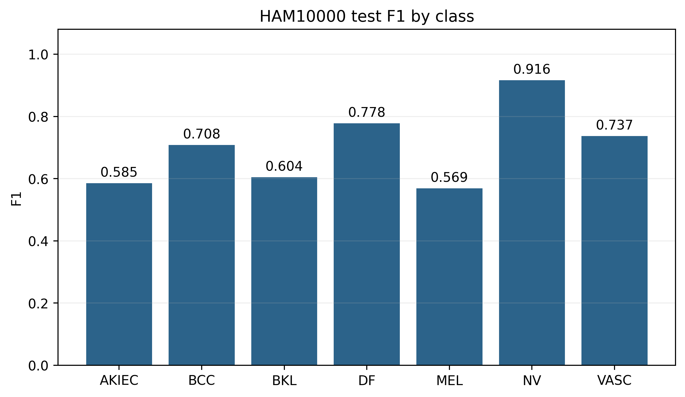
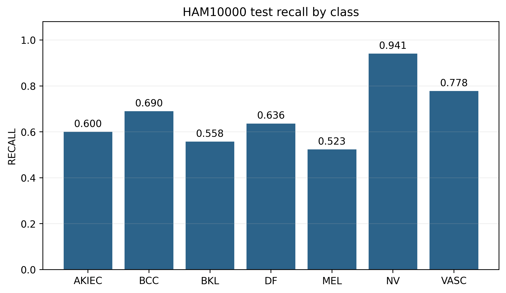
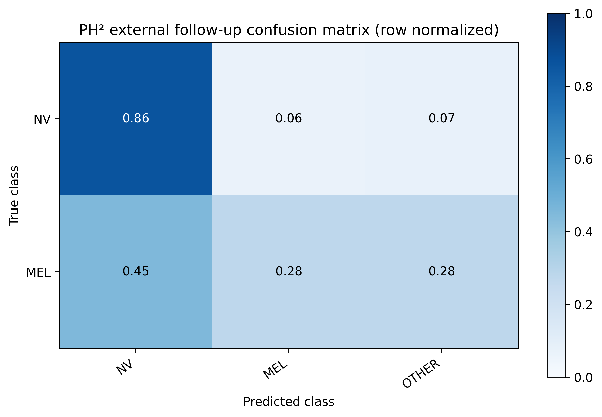

# Supplementary figures for the final EG-VAN reconstruction manuscript

These figures use the closed Stage 16 saved predictions and metrics. They add alternate views of the same evaluation evidence and were not used for model selection.

**Supplementary Figure S1.** Row-normalized seven-class confusion matrix for the 1,014-image HAM10000 held-out test. Each row represents one true class; fractions are conditioned on that class.

**Supplementary Figure S2.** Classwise F1 scores on the held-out HAM10000 test under the frozen seven-class argmax prediction rule.

**Supplementary Figure S3.** Classwise recall on the held-out HAM10000 test. Class supports differ substantially, particularly DF (11) and NV (676).

**Supplementary Figure S4.** Row-normalized PH² external follow-up confusion matrix for 80 mapped NV and 40 mapped MEL cases. OTHER retains predictions outside NV/MEL; 80 atypical nevi were excluded by the frozen protocol. PH² had prior project use and is not untouched validation.
